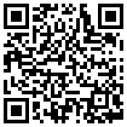

# 早期项目股权众筹傻瓜书

申请加入微信讨论群，请使用微信扫一扫以下的二维码图片：

**我对天发誓，这本书里提到过的每一个错误我自己都犯过**。

很多的时候，提前知道道理并不妨碍在关键的时候出错，也不妨碍下次不小心再次犯同样的错误。

把过往的经历整理出来放在这里，无非是想着：

> 万一对谁有用呢？

**我自觉不笨，却常常觉得昨天的自己很傻很傻**。

这是真实的感觉，甚至我一度因此深深自卑。

后来花了很长时间说服自己：

> 也许是因为你进步太快呢？

当然，自己也知道，这只是一种安慰。进步虽然每天都有，但确实每天都觉得自己进步得太慢——因为世界发展太快，时代的红利总是让更多更年轻的人步伐更快更紧。

所以，如若这些经历、建议对他人有用，终归是好事。

