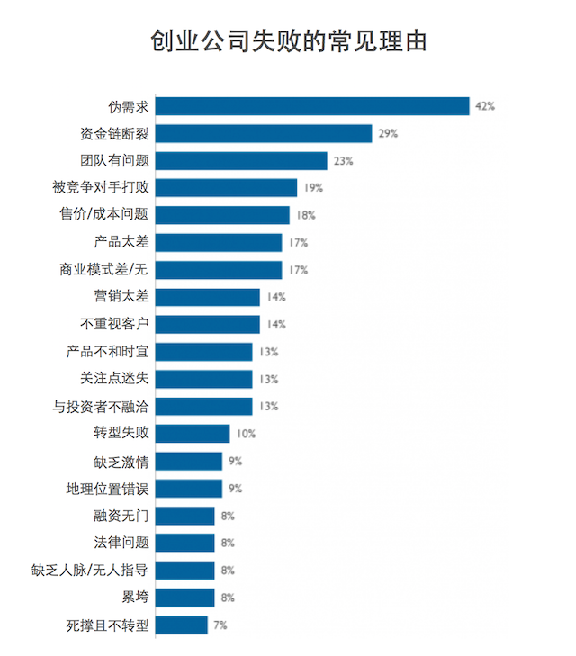

#早期项目投资者的退出机制是什么？

事实情况是，**绝大多数早期项目根本没有退出机制**。这个意外的现象一般是两个原因造成的。

> 1. 大多数早期项目的创业者并无创业经验，更无融资经验；而大多数投资早期项目的业余投资人也没有经验，通常都是“以后再说罢”这种类型……
> 2. 项目自然而然地死了。

第二种情况其实比看起来得普遍——因为绝大多数投资人对自己的失败案例通常是绝口不提的，于是，失败的项目一如既往地多，却异常地少见（很，真的很少见得到）。

Paul Graham 的观察是，创业公司通常会死掉，要么钱不够了，要么某个联合创始人离开了……Steve Hogan 的观察是，首先单个创始人很难成功，其次产品被证明为是基于伪需求的是最大的失败原因——至于钱不够了，通常只是表征，实际原因只不过是乱花钱啊，或产品太差（乃至于融不到下一轮）之类的。

在这种情况下，投资人有没有办法更好地保护自己呢？

职业投资人或投资机构的做法通常是：

> 自己选择好赛道之后，在此赛道里投很多个项目，甚至同类项目也不放过。

职业投资人或投资机构还有另外一个常见手段：

> 在找到下一个买家之前，根本就不投。（通常这是绝口不提的事情）

业余投资者通常无法采用这些方式：

> * 选择赛道的能力有限——最多是研究一下职业机构目前正在关注的赛道有哪些（可实际上专业机构通常都是在布局完成之后才公开自己的选择）……
> * 项目源不够广泛，甚至只能触及到自己当前看得到的那个项目……
> * 资金量上不允许……
> * 投资者关系远远不足……

另外，很多业余投资人根本不知道，作为早期投资者，想要退出可能需要等上好几轮。因为这种靠风险投资驱动的企业，融资不是为了购买老股——后来的投资者最不喜欢这点，因为新近的融资是用来扩张的。而新融资进来之后，估值虽然上涨了，但实际可支配的现金其实并没有那么多，全都用来购买老股都可能不够用——因为老股就算被稀释了，价格也上涨了很多倍。另外一些情况下，老股可能是被迫套现，因为后来的大鳄不想带老股东玩了……

于是，对业余投资者来说，可能的可行方式是：

> 签署可转债协议。

项目成功了，这些投资转成股份；项目失败了，这些投资转成无息贷款，有钱再还。一般来说，这是不得已的办法——因为在这种投资设定里，要求创业者拿出抵押物并不现实，而无抵押的债券，通常没有赎回保障。所以，这种可转债的协议中，一般也不设年限，也无利息设置（在 PE 投资中，通常会设置一个比银行利率高一些的利率，比如年化 10% 之类的）——反正只能看创始人的人品。

可是一般业余投资人对这样的保护办法常常感到“羞于启齿”——当然，这也恰恰是“业余”的表现。

对自己不够自信的创始人常常也讨厌这种方式，因为在他们眼里，“拿别人钱去冒险”是天经地义的。

说来也怪，你不看好的时候，大家都不看好，一旦你看好的时候，很多人都会看好……于是市场上会有大量的投资人与你竞争，你要求签署可转债条款，会削弱你的优势……

这就是艰难的选择。

对目前（2015 年 8 月）国内的众筹平台上的投资者来说，风控手段尚不完整。其中的一个表现就是根本看不到哪个早期项目是签署可转债条款的——美其名曰“对创业者友好”，其实根本就是无知无畏。

